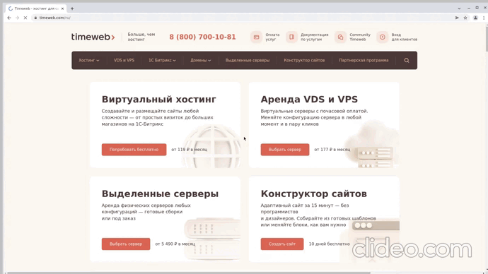

# Проект по автоматизации тестирования сайта [timeweb](https://timeweb.com/ru/)


# <a name="Technology">Технологический стек</a>
<p  align="center">
  <code></code>
  <code></code>
  <code></code>
  <code></code>
  <code></code>
  <code></code>
  <code></code>
  <code></code>
  <code></code>
  <code></code>
  <code></code>
</p>

Написан на `Java` с использованием фреймворка `Selenide`
Применяется фреймворк для модульного тестирования `JUnit 5`
`Gradle` используется для автоматизированной сборки проекта
Система `Allure Report` формирует отчет о запуске тестов
`Telegram`-бот отправляет уведомление о результатах прохождения тестов


# <a name="HowToRun">Содержание тест-кейсов</a>

- [x] Проверка перехода с главной на страницу стоимости виртуальногохостинга
- [x] Открытие окна оплаты услуг
- [x] Открытие окна тарифов 1С-Битрикс
- [x] Проверка поиска
- [x] Проверка свободного домена для покупки

# <a name="HowToRun">Запуск тестов из терминала</a>

## <a name="GradleCommand">Локальный запуск тестов</a>

```bash
gradle clean test
```

## <a name="GradleCommand">Запуск с параметрами:</a>
```bash
clean
test
"-DselenoidUrl=${SELENOID_URL}"
"-DbrowserSize=${BROWSER_SIZE}"
"-Dbrowser=${BROWSER}"
"-DbrowserVersion=${BROWSER_VERSION}"
```
###    Параметры сборки
```SELENOID_URL``` – адрес удаленного сервера, на котором будут запускаться тесты.

```BROWSER_SIZE``` – размер окна браузера, в котором будут выполняться тесты.

```BROWSER``` – браузер, в котором будут выполняться тесты.

```BROWSER_VERSION``` – версия браузера, в которой будут выполняться тесты.

###  Сформированный отчет **"Allure Report"**

 

 

###  Уведомления в Telegram с использованием бота

  

К каждому тесту в отчете прилагается видео.
<p align="center">
  
</p>


